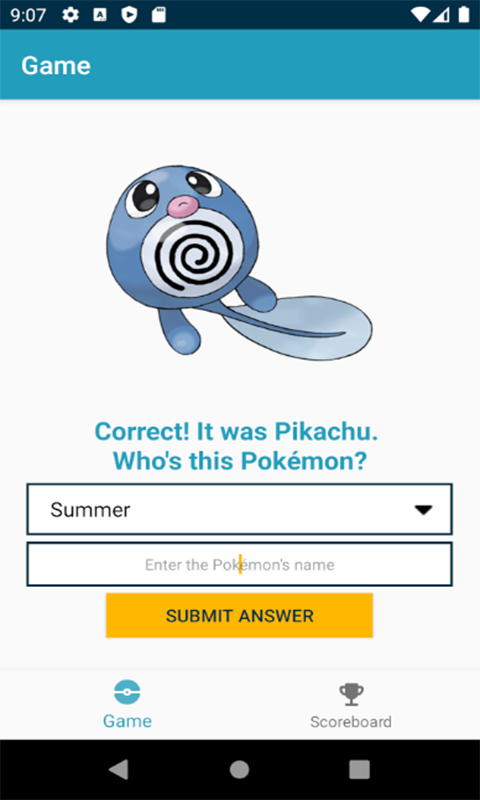

# finalProject
## Ha Dinh's Final Project - Who's That Pokemon?

Are you a Pokémon Master? Put your knowledge to the test and see if you can top your friends' scores.

Upon starting the game, you'll be presented with the game board, which contains the following features:

1. Current Pokémon: The image of the current Pokémon. Can you identify it correctly?

2. Players Drop-down List: Tap this drop-down list to pick a player.

3. Entry Box: Place your guesses into this box.

4. Submit Button: Submit your answer and see if your guess is correct.

You can see the scoreboard under the Scoreboard menu tab with all of the records ordered by the players' scores in a descending manner. 

Moreover, you can add a new player to the game and choose to play as the newly created player.

## Screenshots

All trademarks herein belong to The Pokémon Company, Nintendo and Game Freak, Inc. No copyright infringement is intended.
